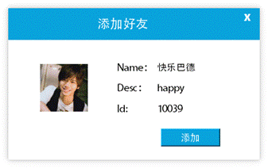

# 企业即时通讯项目

## Building

> 整体代码结构
>
> ./
>
> 
>
> |-src
>
> ​	|-client				//所有的客户端代码
>
> ​	|-database		 //数据库相关的头文件
>
> ​	|-server			  //服务器端代码
>
> ​	|-utility				//公共模块头文件，包括锁及相关的结构类型
>
> ​	|-sql					//数据库建表相关语句


### 数据库


- 数据库使用mysql，整个项目总共建立了7张表，可以直接运行`.\src\sql`下的7个.sql文件建立数据库

- 本项目中数据库和server端分属不同的服务器，也可以放置同一个服务器中

- 修改数据库连接属性，可以在`.\server\server.cpp`的第70行中找到如下代码，修改IP，用户以及密码等信息，即可连接到相应的数据库

  ```c++
  //void DbPool::init(string ip, string user, string password, string dbname, int port, int maxConn)
  db_pool->init("121.36.xxx.xxx", "root", "password", "db_name", 3306, 8);//创建数据库连接池
  ```

### 前端部分

UI来源：https://github.com/gzwz/QQLikeUI

- 前端部分使用QT安装，请先安装QT，下载安装最新版QT即可，若遇到版本问题，可尝试和开发者使用相同的版本QT 5.9.x或QT 5.12.x

- 使用QT creator打开`.\src\client\UI\UI.pro`，编译运行

- 在目录`.\src\client\UI\src\model.\user.cpp`中修改服务器地址

  ```c++
  void User::connect()
  {
      //连接socket
      socket->connectToHost(QHostAddress("ip"), port);//改为你的服务器的IP和端口
  }
  ```

### 后端部分

- 后端基于linux操作系统进行开发，使用到了`mysql.h`，故需要先安装对应的依赖模块模块，Ubuntu下，可以尝试输入

  > sudo apt-get install libmysqlclient-dev

  完成安装，centos下可以尝试输入，完成按照

  > sudo yum install mysql-community-devel.x86_64

- 服务器端构建依赖make工具，若没有安装，可先执行相关命令进行安装。在当前README文件所在目录打开命令行，切换到`./src/server/`，执行输入make即可生成名为server的可执行文件，输入`./server 'port_num'`即可运行服务端程序


## 用户手册

一、注册 


用户打开【登陆界面】点击【注册账号】，将会弹出注册账号界面。


用户在【昵称】输入框中输入用户想使用的昵称，在【密码】输入框设置密码，点击【注册】按钮即可创建账号。

未输入【昵称】或【密码】将会给与提示。

 


注册成功后，用户会得到账号id。用户需记住账号id用于之后的登录。注册成功后便可关闭注册界面。


 

二、登录

用户在【登陆界面】输入框中输入正确的账号id和对应的密码，点击【登录】后即可自动跳转到【主界面】。


三、添加好友


用户在【搜索栏】输入用户的id，点击主界面的【找人】，即可得到搜索结果并弹出【添加好友】窗口。




点击【添加】按钮发送添加好友请求，目标用户将会在【通知列表】收到添加好友的通知，并有声音提示，用户可选择【同意】或【忽略】。


同意请求后，会在双方【好友列表】添加对方的信息。


搜索已经添加的好友，会禁用【添加】按钮，并提示已为好友。


四、好友通信

点击【好友列表】里的用户即可打开对应的聊天窗口。


在【文本输入框】输入要发送的信息，点击【发送】按钮即可发送消息。对方在收到消息时会有音效提示，未打开聊天窗口会有通知红标，打开聊天窗口会直接显示信息。

